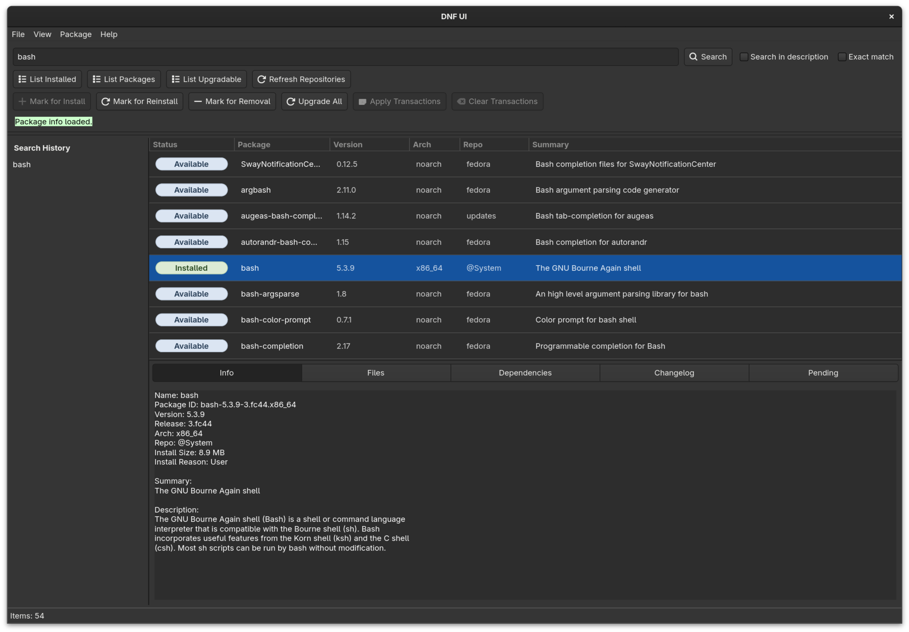
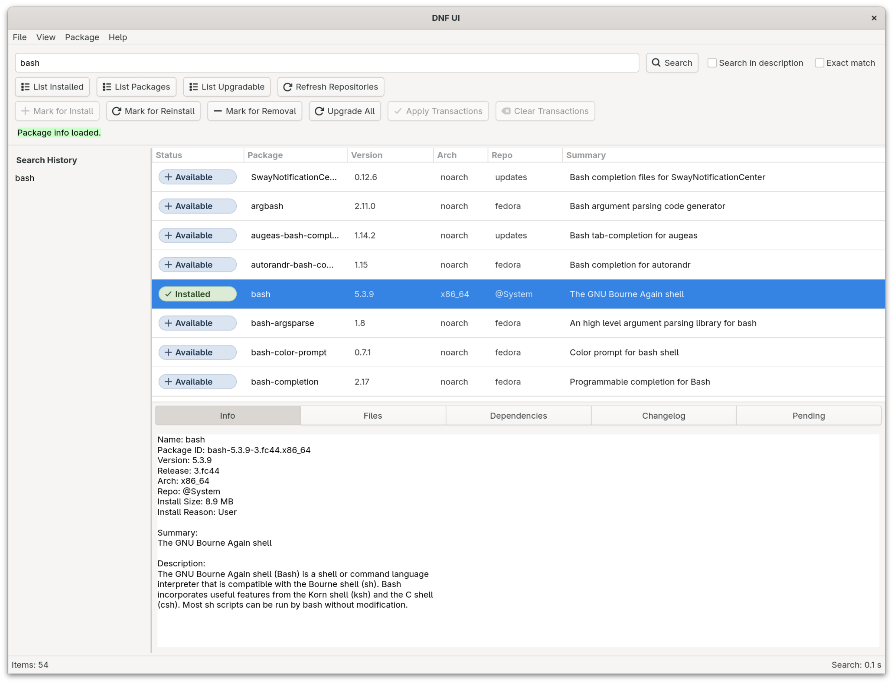

# DNF UI

<p align="center">
  
</p>

DNF UI is a graphical frontend for Fedora's DNF (Dandified YUM) package manager, inspired by [Synaptic](https://github.com/mvo5/synaptic).
It is built with GTK 4 and [libdnf5](https://github.com/rpm-software-management/dnf5) and aims to provide a **fast** and **dependable** package management workflow for Fedora.

## Status

DNF UI is in active early development.
The project is usable for testing and is becoming more mature with each release.
Some interfaces, behavior, and features may still change while the application
continues to stabilize.

## Goals and principles

- User experience first!
- Stability, reliability and predictability
- Strong focus on code quality and maintainability
- No unnecessary complexity or bloat

## Scope

DNF UI is a package manager frontend, **NOT** an app store.

It focuses on fast package search, package details, installed package inspection,
explicit transaction review, and applying DNF package transactions through Polkit.

DNF UI does **NOT** aim to manage Flatpaks, firmware updates, ratings, featured
applications, or software-center discovery workflows.
There are other applications for this like [GNOME Software](https://apps.gnome.org/Software/).

## Current features

- Search repo packages together with installed-only local RPMs
- List available, installed and upgradable packages
- View package details, files, dependencies, and changelog information
- Mark packages for install, reinstall, and removal
- Upgrade all installed packages with available updates
- Review a transaction summary before applying changes
- Apply transactions through a privileged system service with Polkit authorization
- Cancel long-running package queries
- Search history

The main browse and search views keep one visible row per package name and
architecture. Repo candidates stay visible as usual, and locally installed RPMs
that are not present in enabled repositories are listed as `Installed (local
only)`.

## Why?

I started DNF UI because I am not satisfied with the current graphical package management options on Fedora.
I want a package manager frontend that feels fast, reliable, and easy to understand in daily use.

This project is also a practical way for me to learn more about libdnf5, GTK 4, and building a
maintainable desktop application.
The goal is not to experiment for its own sake, but to build something genuinely useful for me and others.

## Build

### Native build

Fedora build dependencies are listed in
[docs/fedora-native-dependencies.txt](docs/fedora-native-dependencies.txt).

Install them with:

```sh
./utils/install_fedora_dependencies.sh
```

Meson handles the real build and install logic.
The `Makefile` is a thin task runner for the common developer commands.

Build and run:

```sh
make && ./dnfui
```

Build final and run:

```sh
FINAL=y make && ./dnfui
```

Run the Meson setup directly:

```sh
meson setup build/debug --prefix /usr --libexecdir libexec
meson compile -C build/debug
./build/debug/src/dnfui
```

## Polkit integration

DNF UI uses a small privileged transaction service for package apply operations.

The GUI runs as the regular desktop user, while the service runs on D-Bus and is
responsible for the privileged transaction step.

[Polkit](https://github.com/polkit-org/polkit) is used only for the apply step:

- Transaction preview is prepared through the service
- The GUI shows the summary dialog
- Apply is authorized by Polkit on the native system bus

This keeps the main application **unprivileged** while still allowing normal desktop
authentication when a transaction is applied.

### Native service install for development

For native Polkit testing from the source tree, install the service files with:

```sh
make
sudo make serviceinstall
```

Then run the app as a regular desktop user:

```sh
./dnfui
```

When you apply a transaction, the desktop Polkit prompt should appear.

Remove the development service install with:

```sh
sudo make serviceuninstall
```

**NOTE:**

- `serviceinstall` is a development helper, not the final packaging flow
- Choose a non critical installed package for native apply tests
- `sudo make serviceinstall` installs the already built Meson service files from the current build tree and does not rebuild

### Tests

Run the test suite:

```sh
make test
```

For the full test matrix, Docker test commands, and memory checks, see
[docs/testing.md](docs/testing.md).

For architecture notes and source-backed external API assumptions, start with
[docs/architecture.md](docs/architecture.md).

### Docker

[Docker](https://www.docker.com/) is the default container runtime. The container targets also support
[Podman](https://podman.io/) by setting `CONTAINER_RUNTIME=podman`. The target names stay unchanged
for compatibility.

Running the application in a container is useful for testing and developing without affecting the
host system.

Build the development image:

```sh
make dockersetup
```

Build the development image with Podman:

```sh
CONTAINER_RUNTIME=podman make dockersetup
```

Run the application in a container:

```sh
make dockerrun
```

Run the application in Docker with networking disabled:

```sh
make dockerrunoffline
```

Run the application in Docker with networking disabled and an empty repo cache:

```sh
make dockerruncoldoffline
```

## RPM packaging

Fedora RPM packaging is included in this repository.

Build a source RPM from the current tracked working tree:

```sh
make srpm
```

Build binary and source RPMs locally:

```sh
make rpm
```

Build a source RPM in Docker:

```sh
make dockersrpm
```

Build binary and source RPMs in Docker:

```sh
make dockerrpm
```

Artifacts are written under `./rpmbuild/`.

Notes:

- The RPM package is built from `dnf-ui.spec`, using Fedora's normal Meson RPM macros
- `make srpm` includes files tracked by Git in the generated source tarball
- The Docker RPM targets use the existing Fedora development image and write artifacts into the same `./rpmbuild/` tree

Run `rpmlint` on the source RPM and binary RPMs:

```sh
rpmlint dnf-ui-latest.src.rpm rpmbuild/RPMS/*/*.rpm
```

To check that the package builds without depending on files or packages from your
own system, rebuild the generated source RPM in an isolated Fedora build
environment with `mock`:

```sh
mock -r fedora-rawhide-x86_64 --rebuild dnf-ui-latest.src.rpm
```

Use a different `-r` value if you want to build for another Fedora release or
architecture.

## Screenshots

<p align="center">
  
</p>

<p align="center">
DNF UI running on GNOME.
</p>

<p align="center">
  
</p>

<p align="center">
DNF UI running on KDE.
</p>
