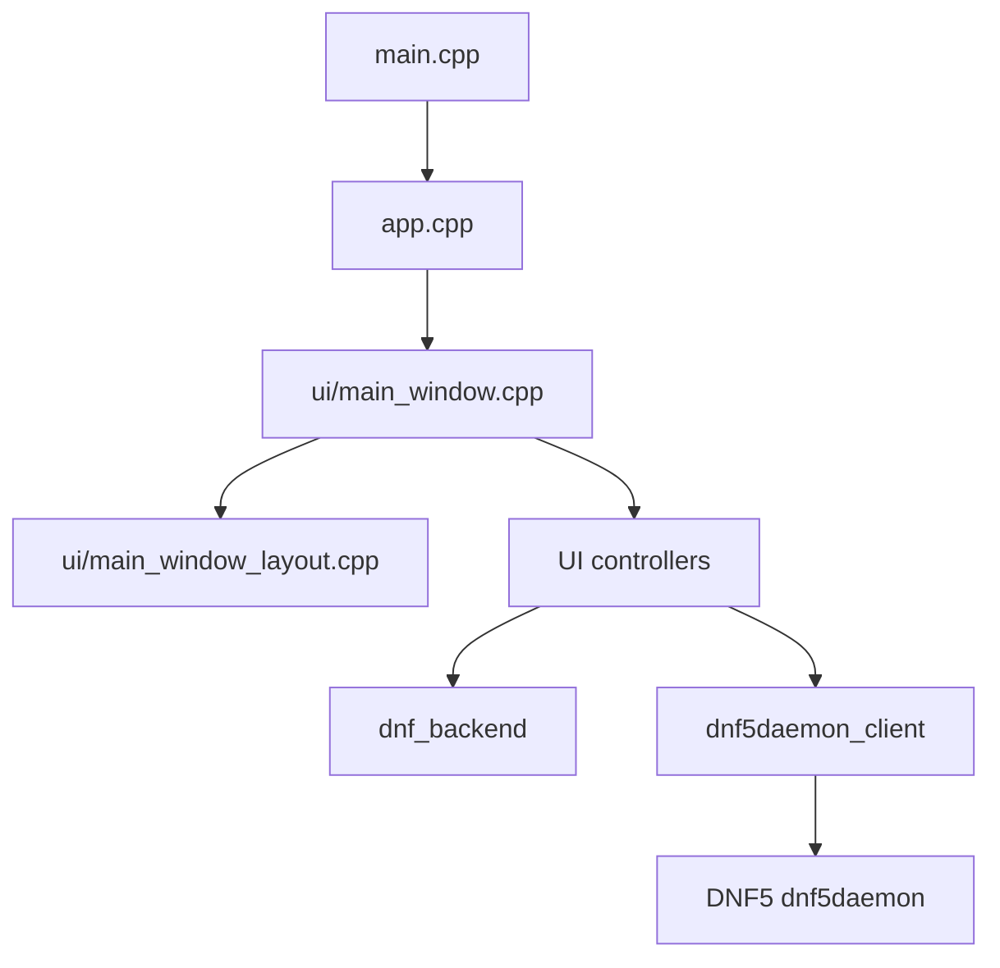
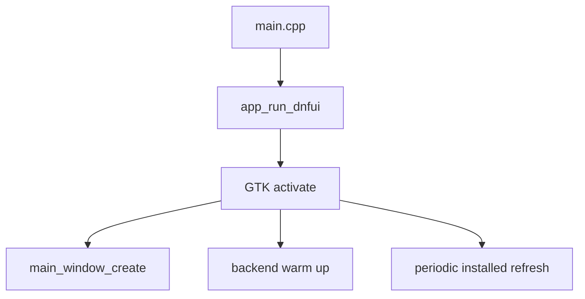
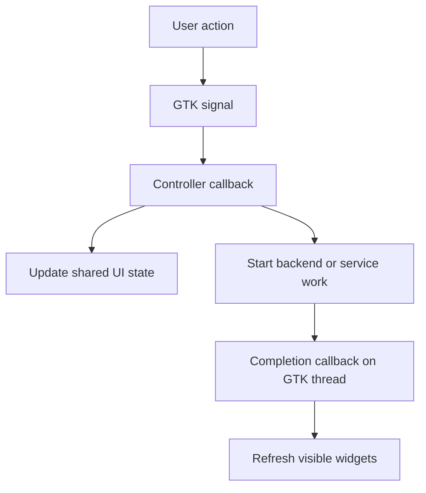
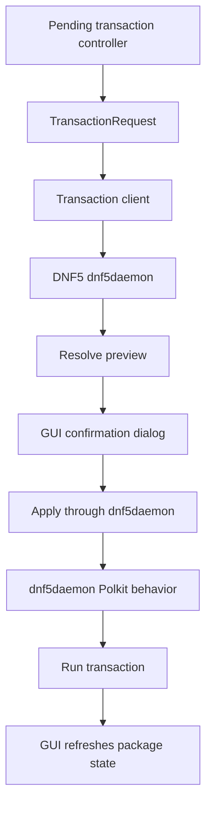

# DNF UI architecture

This is the overview document for DNF UI.

Use it as the first map when reading the code. The deeper documents are:

- [UI internals](ui.md)
- [Backend internals](backend.md)
- [Transaction flow](transactions.md)
- [Testing](testing.md)
- [External API assumptions](api-assumptions.md)
- [Project rules](project-rules.md)

## Purpose

DNF UI is a GTK 4 package manager frontend for Fedora.

The main application stays unprivileged. It searches packages, shows package
details, lets the user mark package actions, and shows a review step. Package
changes are sent to DNF5 dnf5daemon, which owns the privileged package work
and Polkit behavior.

## Key terms

- GTK is the user interface toolkit used to build the window.
- libdnf5 is the Fedora package management library used for package queries and details.
- Base is the libdnf5 object that holds loaded repository and installed package
  state.
- rpmdb is the local database of packages installed on the system.
- NEVRA means name, epoch, version, release, and architecture. It identifies one
  exact package build.
- EVR means epoch, version, and release. The backend uses it when comparing
  package versions.
- D-Bus is the local message bus used by the GUI to call dnf5daemon.
- Polkit is the authorization service used by dnf5daemon before privileged package apply work.
- GTask is the GLib helper used to run slow work away from the GTK thread and return results safely.

## Main parts

The application is split into five main areas:

- Startup and main window setup
- UI controllers
- libdnf5 backend
- Shared transaction request model
- dnf5daemon transaction client

## Package data and transaction data

DNF UI deliberately uses two package-management paths.

libdnf5 is used for package views. It is fast, runs in the unprivileged GUI
process, and gives the app the package details needed for the table, search,
installed packages, files, dependencies, and changelog text.

dnf5daemon is used for transaction decisions and package changes. It is the
service that resolves previews, applies transactions, handles Polkit
authorization, and deals with repository signing keys. Anything that can change
the system must go through dnf5daemon.

The List Upgradable view sits between those two paths. The visible rows are
built from libdnf5 so the table can show normal package information. Before
those rows are shown, DNF UI asks dnf5daemon to resolve its native Upgrade All
preview and keeps only rows whose package name and architecture are present in
that resolved preview. This keeps the view useful while avoiding rows that the
transaction service would not accept.

This split is intentional, but it is also a boundary that may change in a later
version if dnf5daemon gains a better read API for the full package table.

## Startup

Startup follows a short path:

- [src/main.cpp](../src/main.cpp) calls `app_run_dnfui`
- [src/app.cpp](../src/app.cpp) creates the GTK application and handles activation
- [src/ui/main_window.cpp](../src/ui/main_window.cpp) creates the main window and wires signals
- [src/ui/main_window_layout.cpp](../src/ui/main_window_layout.cpp) builds the main window widget tree

After the window is created, `app.cpp` also starts two background tasks:

- backend warm up, so the first package query is faster
- periodic installed-package snapshot refresh

## UI structure

The main window is built once and the controller files own behavior.

- [src/ui/main_window.cpp](../src/ui/main_window.cpp) creates shared widget state and connects signals.
- [src/ui/main_window_layout.cpp](../src/ui/main_window_layout.cpp) builds the main window widget tree.
- [src/ui/widgets.hpp](../src/ui/widgets.hpp) groups the widget pointers and shared UI state.
- [src/ui/widgets.cpp](../src/ui/widgets.cpp) handles task helpers shared by controllers.
- [src/ui/repository_refresh_controller.cpp](../src/ui/repository_refresh_controller.cpp) handles manual repository refresh.
- [src/ui/main_menu.cpp](../src/ui/main_menu.cpp) handles top menu actions.
- [src/ui/package_query_controller.cpp](../src/ui/package_query_controller.cpp) handles the public search, list, history, clear, and reload callbacks.
- [src/ui/package_query_controls.cpp](../src/ui/package_query_controls.cpp) handles active package-query request state, Stop button handling, cancellation, and refresh completion.
- [src/ui/package_query_tasks.cpp](../src/ui/package_query_tasks.cpp) contains package-query worker tasks and completion handlers.
- [src/ui/package_info_controller.cpp](../src/ui/package_info_controller.cpp) handles selection and details loading.
- [src/ui/package_table_view.cpp](../src/ui/package_table_view.cpp) builds the package table.
- [src/ui/package_table_model.cpp](../src/ui/package_table_model.cpp) stores package rows in GTK objects.
- [src/ui/package_table_sort.cpp](../src/ui/package_table_sort.cpp) contains package table sorting rules.
- [src/ui/pending_transaction_controller.cpp](../src/ui/pending_transaction_controller.cpp) handles package action buttons.
- [src/ui/pending_transaction_view.cpp](../src/ui/pending_transaction_view.cpp) builds the Pending Actions tab.
- [src/ui/pending_transaction_apply.cpp](../src/ui/pending_transaction_apply.cpp) handles preview, apply, and post-apply refresh.
- [src/ui/transaction_review_dialog.cpp](../src/ui/transaction_review_dialog.cpp) builds the review and error dialogs.
- [src/ui/transaction_progress.cpp](../src/ui/transaction_progress.cpp) manages the live progress window.

The UI controller pattern follows this shape:

## Backend structure

The UI does not use libdnf5 types directly.

The public backend API is [src/dnf_backend/dnf_backend.hpp](../src/dnf_backend/dnf_backend.hpp).
It exposes small value types such as `PackageRow`, `PackageInstallState`, and
`TransactionPreview`.

The backend implementation is split by responsibility:

- [src/base_manager.cpp](../src/base_manager.cpp) manages the shared libdnf5 `Base`.
- [src/dnf_backend/dnf_query.cpp](../src/dnf_backend/dnf_query.cpp) builds package rows for search, browse, and installed-list views.
- [src/dnf_backend/dnf_details.cpp](../src/dnf_backend/dnf_details.cpp) formats package details, files, dependencies, and changelog text.
- [src/dnf_backend/dnf_state.cpp](../src/dnf_backend/dnf_state.cpp) keeps installed-package snapshot state and package status classification.

Most query and details calls take serialized read access to the shared Base.
That access is exclusive inside `BaseManager` because read-only `PackageQuery`
work can still touch shared libdnf5 `Base` internals. Transaction preview and
apply work goes through dnf5daemon instead of a local libdnf transaction path.

The shared Base does not request changelog `other` metadata. Changelog details
read installed packages from the shared Base because rpmdb changelog metadata
is local. Available package changelogs use a temporary Base with repository
changelog metadata, after releasing the shared Base read lock.

## Package list model

The main list shows one row for each package name and architecture pair.

When repository metadata is available, repository candidates are shown. Installed
packages that do not have a visible repository candidate are added as local-only
rows. Installed packages can also be shown as upgradeable or newer than the
repository candidate.

The installed snapshot in [src/dnf_backend/dnf_state.cpp](../src/dnf_backend/dnf_state.cpp)
is important because it lets the UI answer:

- whether an exact NEVRA is installed
- whether a row is available, installed, local-only, or upgradeable
- whether a package owns the running GUI executable and must be protected from removal inside the app

## Transaction boundary

Search, browsing, and details stay inside the GUI process.

Preview and apply go through DNF5 dnf5daemon:

- GUI client: [src/dnf5daemon_client/transaction_service_client.cpp](../src/dnf5daemon_client/transaction_service_client.cpp)
- GUI client D-Bus calls: [src/dnf5daemon_client/transaction_service_client_dbus.cpp](../src/dnf5daemon_client/transaction_service_client_dbus.cpp)
- GUI client wait handling: [src/dnf5daemon_client/transaction_service_client_wait.cpp](../src/dnf5daemon_client/transaction_service_client_wait.cpp)
- shared request model: [src/transaction_request.hpp](../src/transaction_request.hpp)

The client opens one dnf5daemon session for each prepared transaction. The GUI
shows the resolved preview, applies through the same session if the user
confirms, and closes the session when it is no longer needed.

## Packaging

Packaging metadata lives under [packaging](../packaging).

DNF UI requires Fedora `dnf5daemon-server` for package changes. It does not
install its own transaction service, Polkit policy, D-Bus policy, or systemd
unit for package apply work.

The security boundary is described in [docs/systemd-hardening.md](systemd-hardening.md).

Meson owns the real build and install rules. The `Makefile` is a task runner for
common developer commands.

## Reading order

A practical reading order for new contributors:

1. [src/main.cpp](../src/main.cpp)
2. [src/app.cpp](../src/app.cpp)
3. [src/ui/main_window.cpp](../src/ui/main_window.cpp)
4. [src/ui/main_window_layout.cpp](../src/ui/main_window_layout.cpp)
5. [src/ui/widgets.hpp](../src/ui/widgets.hpp)
6. [src/ui/package_query_controller.cpp](../src/ui/package_query_controller.cpp)
7. [src/ui/pending_transaction_controller.cpp](../src/ui/pending_transaction_controller.cpp)
8. [src/ui/pending_transaction_view.cpp](../src/ui/pending_transaction_view.cpp)
9. [src/ui/pending_transaction_apply.cpp](../src/ui/pending_transaction_apply.cpp)
10. [src/dnf_backend/dnf_backend.hpp](../src/dnf_backend/dnf_backend.hpp)
11. [src/base_manager.cpp](../src/base_manager.cpp)
12. [src/dnf_backend/dnf_query.cpp](../src/dnf_backend/dnf_query.cpp)
13. [src/dnf5daemon_client/transaction_service_client.cpp](../src/dnf5daemon_client/transaction_service_client.cpp)
13. [src/dnf5daemon_client/transaction_service_client_dbus.cpp](../src/dnf5daemon_client/transaction_service_client_dbus.cpp)
14. [src/dnf5daemon_client/transaction_service_client_wait.cpp](../src/dnf5daemon_client/transaction_service_client_wait.cpp)
15. [docs/transactions.md](transactions.md)
