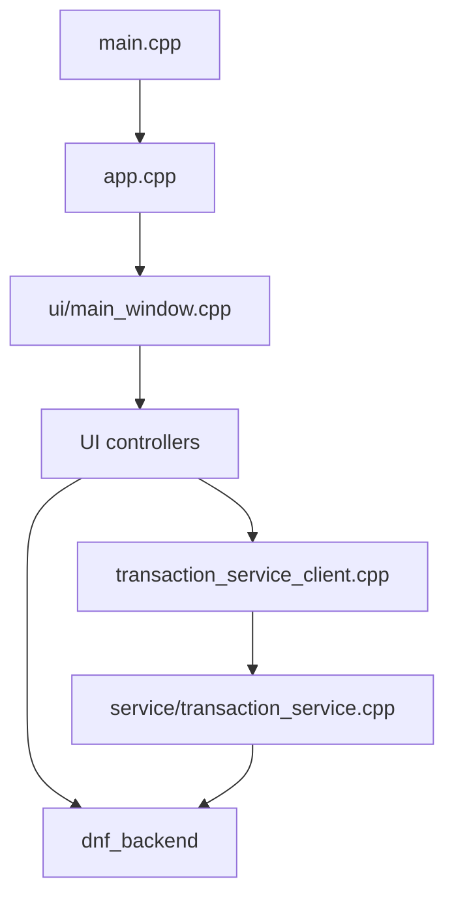
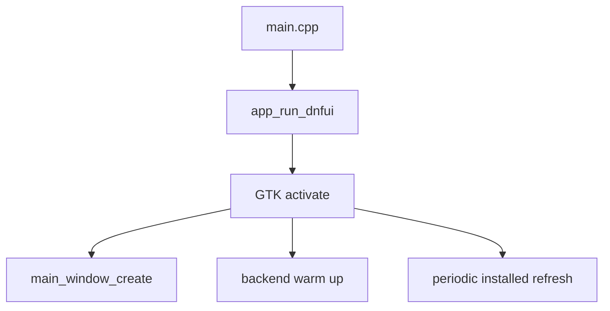
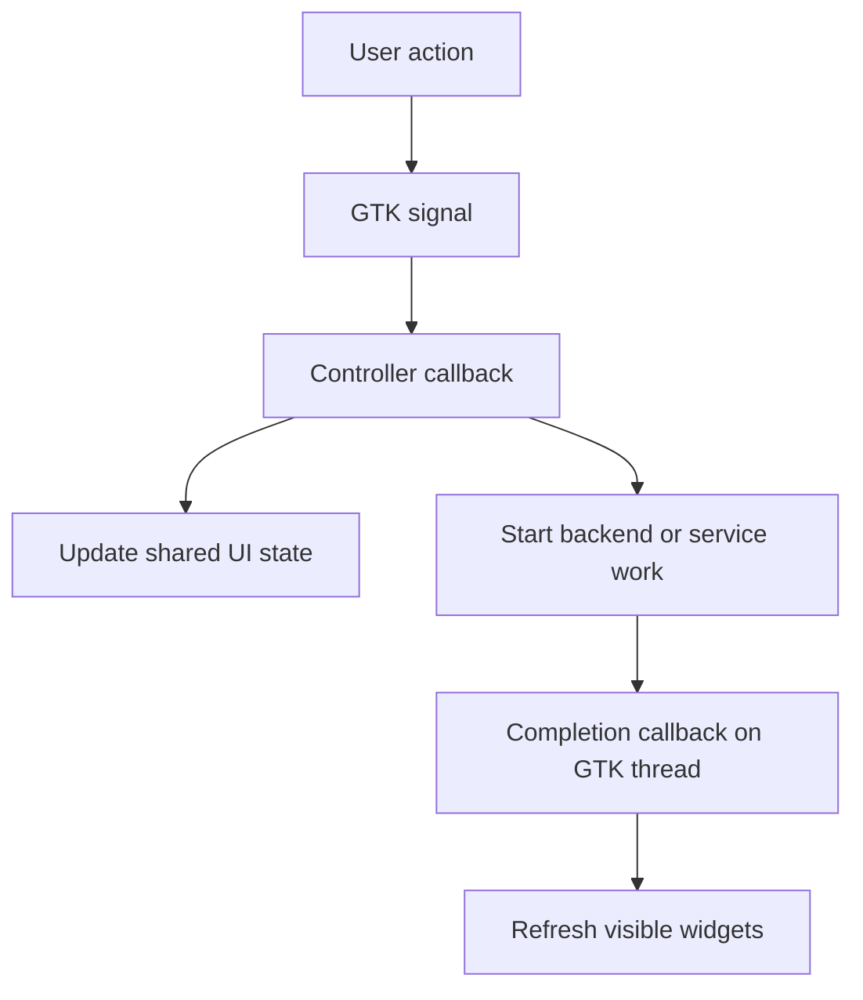
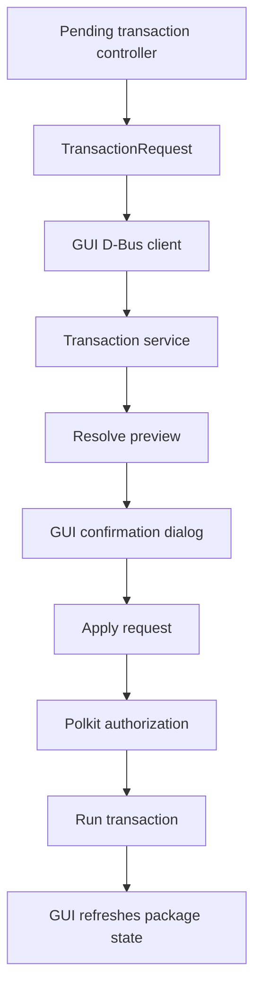

# DNF UI architecture

This is the overview document for DNF UI.

Use it as the first map when reading the code. The deeper documents are:

- [UI internals](ui.md)
- [Backend internals](backend.md)
- [Transaction service internals](transactions.md)
- [Testing](testing.md)
- [External API assumptions](api-assumptions.md)
- [Project rules](project-rules.md)

## Purpose

DNF UI is a GTK 4 package manager frontend for Fedora.

The main application stays unprivileged. It searches packages, shows package
details, lets the user mark package actions, and shows a review step. Package
apply work is sent to a small D-Bus transaction service, where Polkit can
authorize the privileged step.

## Key terms

- GTK is the user interface toolkit used to build the window.
- libdnf5 is the Fedora package management library used for package queries and
  transactions.
- Base is the libdnf5 object that holds loaded repository and installed package
  state.
- rpmdb is the local database of packages installed on the system.
- NEVRA means name, epoch, version, release, and architecture. It identifies one
  exact package build.
- EVR means epoch, version, and release. The backend uses it when comparing
  package versions.
- D-Bus is the local message bus used by the GUI and transaction service to
  call each other.
- Polkit is the authorization service used before privileged package apply work.
- GTask is the GLib helper used to run slow work away from the GTK thread and
  return results safely.

## Main parts

The application is split into five main areas:

- Startup and main window setup
- UI controllers
- libdnf5 backend
- Shared transaction request model
- D-Bus transaction service and GUI client

## Startup

Startup follows a short path:

- [src/main.cpp](../src/main.cpp) calls `app_run_dnfui`
- [src/app.cpp](../src/app.cpp) creates the GTK application and handles activation
- [src/ui/main_window.cpp](../src/ui/main_window.cpp) builds the main window and wires signals

After the window is created, `app.cpp` also starts two background tasks:

- backend warm up, so the first package query is faster
- periodic installed-package snapshot refresh

## UI structure

The main window is built once and the controller files own behavior.

- [src/ui/main_window.cpp](../src/ui/main_window.cpp) builds the window, creates shared widget state, and connects signals.
- [src/ui/widgets.hpp](../src/ui/widgets.hpp) groups the widget pointers and shared UI state.
- [src/ui/widgets.cpp](../src/ui/widgets.cpp) handles repository refresh callbacks and task helpers shared by controllers.
- [src/ui/main_menu.cpp](../src/ui/main_menu.cpp) handles top menu actions.
- [src/ui/package_query_controller.cpp](../src/ui/package_query_controller.cpp) handles the public search, list, history, clear, and reload callbacks.
- [src/ui/package_query_controls.cpp](../src/ui/package_query_controls.cpp) handles active package-query request state, Stop button handling, cancellation, and refresh completion.
- [src/ui/package_query_tasks.cpp](../src/ui/package_query_tasks.cpp) contains package-query worker tasks and completion handlers.
- [src/ui/package_info_controller.cpp](../src/ui/package_info_controller.cpp) handles selection and details loading.
- [src/ui/package_table_view.cpp](../src/ui/package_table_view.cpp) builds the package table.
- [src/ui/package_table_model.cpp](../src/ui/package_table_model.cpp) stores package rows in GTK objects.
- [src/ui/package_table_sort.cpp](../src/ui/package_table_sort.cpp) contains package table sorting rules.
- [src/ui/pending_transaction_controller.cpp](../src/ui/pending_transaction_controller.cpp) handles package action buttons.
- [src/ui/pending_transaction_view.cpp](../src/ui/pending_transaction_view.cpp) builds the Pending Actions tab.
- [src/ui/pending_transaction_apply.cpp](../src/ui/pending_transaction_apply.cpp) handles preview, apply, and post-apply refresh.
- [src/ui/transaction_review_dialog.cpp](../src/ui/transaction_review_dialog.cpp) builds the review and error dialogs.
- [src/ui/transaction_progress.cpp](../src/ui/transaction_progress.cpp) manages the live progress window.

The UI controller pattern follows this shape:

## Backend structure

The UI does not use libdnf5 types directly.

The public backend API is [src/dnf_backend/dnf_backend.hpp](../src/dnf_backend/dnf_backend.hpp).
It exposes small value types such as `PackageRow`, `PackageInstallState`, and
`TransactionPreview`.

The backend implementation is split by responsibility:

- [src/base_manager.cpp](../src/base_manager.cpp) manages the shared libdnf5 `Base`.
- [src/dnf_backend/dnf_query.cpp](../src/dnf_backend/dnf_query.cpp) builds package rows for search, browse, and installed-list views.
- [src/dnf_backend/dnf_details.cpp](../src/dnf_backend/dnf_details.cpp) formats package details, files, dependencies, and changelog text.
- [src/dnf_backend/dnf_state.cpp](../src/dnf_backend/dnf_state.cpp) keeps installed-package snapshot state and package status classification.
- [src/dnf_backend/dnf_transaction.cpp](../src/dnf_backend/dnf_transaction.cpp) resolves previews and applies transactions.
- [src/dnf_backend/dnf_transaction_callbacks.cpp](../src/dnf_backend/dnf_transaction_callbacks.cpp) adapts libdnf download and rpm callbacks into progress lines.
- [src/dnf_backend/dnf_transaction_format.cpp](../src/dnf_backend/dnf_transaction_format.cpp) keeps shared transaction text formatting out of the resolver.

Most query and details calls take serialized read access to the shared Base.
That access is exclusive inside `BaseManager` because read-only `PackageQuery`
work can still touch shared libdnf5 `Base` internals. Transaction preview and
apply take write access because libdnf5 transaction work changes Base state
while it is being resolved or run.

The shared Base does not request changelog `other` metadata. Changelog details
read installed packages from the shared Base first because rpmdb changelog
metadata is local. Available-package changelogs use a short-lived temporary Base
so that normal list, search, and transaction paths do not keep that optional
metadata resident.

## Package list model

The main list shows one row for each package name and architecture pair.

When repository metadata is available, repository candidates are shown. Installed
packages that do not have a visible repository candidate are added as local-only
rows. Installed packages can also be shown as upgradeable or newer than the
repository candidate.

The installed snapshot in [src/dnf_backend/dnf_state.cpp](../src/dnf_backend/dnf_state.cpp)
is important because it lets the UI answer:

- whether an exact NEVRA is installed
- whether a row is available, installed, local-only, or upgradeable
- whether a package owns the running GUI executable and must be protected from removal inside the app

## Transaction boundary

Search, browsing, and details stay inside the GUI process.

Preview and apply go through the transaction service:

- GUI client: [src/transaction_service_client.cpp](../src/transaction_service_client.cpp)
- GUI client D-Bus calls: [src/transaction_service_client_dbus.cpp](../src/transaction_service_client_dbus.cpp)
- GUI client wait handling: [src/transaction_service_client_wait.cpp](../src/transaction_service_client_wait.cpp)
- service runtime and shutdown: [src/service/transaction_service.cpp](../src/service/transaction_service.cpp)
- service request objects: [src/service/transaction_service_request_objects.cpp](../src/service/transaction_service_request_objects.cpp)
- service request validation: [src/service/transaction_service_validation.cpp](../src/service/transaction_service_validation.cpp)
- service preview and apply workers: [src/service/transaction_service_workers.cpp](../src/service/transaction_service_workers.cpp)
- service authorization: [src/service/transaction_service_authorization.cpp](../src/service/transaction_service_authorization.cpp)
- service signals: [src/service/transaction_service_signals.cpp](../src/service/transaction_service_signals.cpp)
- shared D-Bus names: [src/service/transaction_service_dbus.hpp](../src/service/transaction_service_dbus.hpp)
- shared request model: [src/transaction_request.hpp](../src/transaction_request.hpp)

The service creates one D-Bus request object for each transaction request. The
GUI reads preview and final result state from that object and releases it when it
is no longer needed. On the system bus, request object methods are accepted only
from the client that created the request.

## Packaging

Service install files live under [packaging](../packaging).

The important files are:

- [packaging/com.fedora.Dnfui.Transaction1.service](../packaging/com.fedora.Dnfui.Transaction1.service)
- [packaging/com.fedora.Dnfui.Transaction1.conf](../packaging/com.fedora.Dnfui.Transaction1.conf)
- [packaging/com.fedora.dnfui.policy](../packaging/com.fedora.dnfui.policy)
- [packaging/dnfui-service.service](../packaging/dnfui-service.service)

Systemd hardening decisions for the transaction service are documented in
[docs/systemd-hardening.md](systemd-hardening.md).

Meson owns the real build and install rules. The `Makefile` is a task runner for
common developer commands.

## Reading order

A practical reading order for new contributors:

1. [src/main.cpp](../src/main.cpp)
2. [src/app.cpp](../src/app.cpp)
3. [src/ui/main_window.cpp](../src/ui/main_window.cpp)
4. [src/ui/widgets.hpp](../src/ui/widgets.hpp)
5. [src/ui/package_query_controller.cpp](../src/ui/package_query_controller.cpp)
6. [src/ui/pending_transaction_controller.cpp](../src/ui/pending_transaction_controller.cpp)
7. [src/ui/pending_transaction_view.cpp](../src/ui/pending_transaction_view.cpp)
8. [src/ui/pending_transaction_apply.cpp](../src/ui/pending_transaction_apply.cpp)
9. [src/dnf_backend/dnf_backend.hpp](../src/dnf_backend/dnf_backend.hpp)
10. [src/base_manager.cpp](../src/base_manager.cpp)
11. [src/dnf_backend/dnf_query.cpp](../src/dnf_backend/dnf_query.cpp)
12. [src/transaction_service_client.cpp](../src/transaction_service_client.cpp)
13. [docs/transactions.md](transactions.md)
14. [src/service/transaction_service.cpp](../src/service/transaction_service.cpp)
15. [src/service/transaction_service_request_objects.cpp](../src/service/transaction_service_request_objects.cpp)
16. [src/service/transaction_service_validation.cpp](../src/service/transaction_service_validation.cpp)
17. [src/service/transaction_service_workers.cpp](../src/service/transaction_service_workers.cpp)
