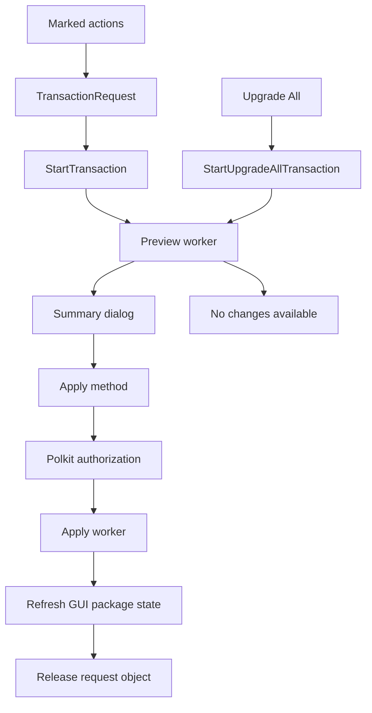
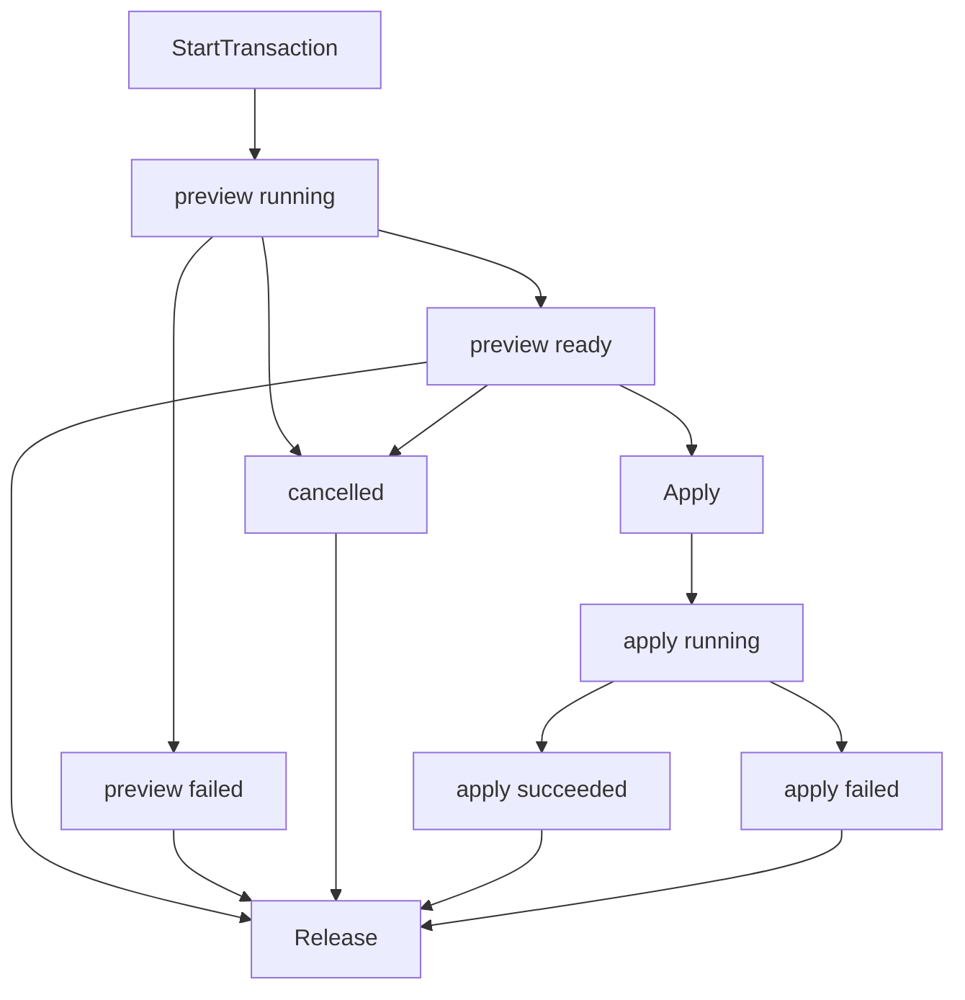

# Transaction Service Internals

This document explains how package preview and apply work.

For source-backed libdnf5, GDBus, and Polkit assumptions, see
[External API assumptions](api-assumptions.md).

## Boundary

The GUI process stays unprivileged.

Package search and details happen in the GUI process. Transaction preview and
apply go through the D-Bus service.

Important files:

- [src/ui/pending_transaction_controller.cpp](../src/ui/pending_transaction_controller.cpp)
- [src/ui/pending_transaction_request.cpp](../src/ui/pending_transaction_request.cpp)
- [src/ui/transaction_review_dialog.cpp](../src/ui/transaction_review_dialog.cpp)
- [src/ui/transaction_progress.cpp](../src/ui/transaction_progress.cpp)
- [src/transaction_request.hpp](../src/transaction_request.hpp)
- [src/transaction_service_client.cpp](../src/transaction_service_client.cpp)
- [src/service/transaction_service.cpp](../src/service/transaction_service.cpp)
- [src/service/transaction_service_authorization.cpp](../src/service/transaction_service_authorization.cpp)
- [src/service/transaction_service_manager.cpp](../src/service/transaction_service_manager.cpp)
- [src/service/transaction_service_request_objects.cpp](../src/service/transaction_service_request_objects.cpp)
- [src/service/transaction_service_signals.cpp](../src/service/transaction_service_signals.cpp)
- [src/service/transaction_service_workers.cpp](../src/service/transaction_service_workers.cpp)
- [src/service/transaction_service_introspection.cpp](../src/service/transaction_service_introspection.cpp)

The transaction service implementation is split by responsibility:

- `transaction_service.cpp` owns the service process runtime and shutdown.
- `transaction_service_manager.cpp` handles the manager object and creates request objects.
- `transaction_service_request_objects.cpp` handles methods on one request object.
- `transaction_service_authorization.cpp` handles Apply authorization.
- `transaction_service_workers.cpp` runs preview and apply backend work.
- `transaction_service_signals.cpp` emits Progress and Finished signals from the service main loop.
- `transaction_service_format.cpp` converts service state into D-Bus reply values.
- `transaction_service_limits.cpp` enforces live request limits.
- `transaction_service_internal.hpp` is the private shared state for these files.

## Request Model

`TransactionRequest` is shared by the GUI and the service.

It contains one upgrade-all flag and three explicit user action lists:

- upgrade all
- install
- remove
- reinstall

Dependency changes are not stored in the request. They are resolved later when
the backend builds the preview.

Upgrade-all requests are mutually exclusive with the explicit package action
lists. They are sent through the separate `StartUpgradeAllTransaction` D-Bus
method and resolved by libdnf5 as one upgrade job for all installed packages.

The GUI builds this request from pending actions in
[src/ui/pending_transaction_request.cpp](../src/ui/pending_transaction_request.cpp).

## GUI Flow

When the user clicks Apply:

1. The pending controller validates the pending actions.
2. The controller builds a `TransactionRequest`.
3. The GUI client calls `StartTransaction` on the service.
4. The service creates a request object and starts preview work.
5. The GUI waits for the preview result.
6. The GUI shows a summary dialog.
7. If the user confirms, the GUI calls `Apply` on the request object.
8. The service authorizes and runs the transaction.
9. The GUI refreshes package state and releases the request object.

When the user clicks Upgrade All, the GUI skips the pending action list and asks
the service to start an upgrade-all request directly. If the resolved preview is
empty, the GUI releases the request object and reports that all packages are
already up to date. Empty previews cannot be applied.

## D-Bus Objects

The service exposes one manager object and one request object per transaction.

The manager object has:

- `StartTransaction`
- `StartUpgradeAllTransaction`

Each request object has:

- `Cancel`
- `Apply`
- `Release`
- `GetPreview`
- `GetResult`
- `Progress` signal
- `Finished` signal

The exact D-Bus shape is declared in
[src/service/transaction_service_introspection.cpp](../src/service/transaction_service_introspection.cpp).

Shared names live in
[src/service/transaction_service_dbus.hpp](../src/service/transaction_service_dbus.hpp).

## Request Lifecycle

One transaction request normally moves through these states:

The GUI client also handles service disappearance while waiting for a result and
returns an error instead of waiting forever.

## Preview

Preview starts when the service creates a request object.

Before the service creates a request object, it validates the shared request
shape, rejects oversized requests, and rejects remove or reinstall requests for
the package that owns the running DNF UI executable.

Before resolving the preview, the service refreshes backend state:

- install, reinstall, and upgrade-all requests need repository metadata
- remove-only requests can use installed-package state only

If refresh fails, the service continues with the package state it can still
load. Remove-only requests can proceed from the local installed package
database without repository metadata.

The preview result is stored on the request object. The GUI reads structured
preview arrays with `GetPreview` and human-readable summary text through the
final state details.

The service also limits active request objects and concurrently running preview
workers so one client cannot create an unbounded amount of backend work.

## Apply

Apply can start only after preview succeeds.

On the system bus, the service asks Polkit to authorize the apply step. On the
session bus, authorization is skipped so development and Docker tests can run
without a system service.

After authorization succeeds, the service runs backend apply work on a worker
thread. Progress lines are emitted through the request object's `Progress`
signal. Final state is emitted through `Finished`.

Before applying, the service refreshes package state again. The backend then
resolves the transaction and compares it with the preview the user approved. If
the result changed, apply is refused and the user must review a new preview.

The apply progress stream comes from two libdnf5 callback paths:

- `libdnf5::repo::DownloadCallbacks` reports package download progress and
  mirror failures.
- `libdnf5::rpm::TransactionCallbacks` reports rpm verification, transaction
  preparation, one line per package action, script errors, and unpack errors.

The callback adapters live in
[src/dnf_backend/dnf_transaction_callbacks.cpp](../src/dnf_backend/dnf_transaction_callbacks.cpp).

The D-Bus signal still carries plain text progress lines. The structure stays
simple so the GUI can append messages without knowing libdnf5 callback types.

Only one apply operation is allowed at a time inside the service.

## Cancellation and Release

Preview can be cancelled before apply starts.

Apply is not cancelled once package work is running.

`Release` is a client cleanup call. It is allowed only after work has reached a
final state and no authorization request is waiting for a Polkit answer.

On the system bus, the service watches the client's bus name. If the client
disconnects, the service starts internal cleanup for that client's transaction
objects so abandoned requests do not accumulate. If this happens before package
apply work starts, the service marks the request cancelled and stops before
package work begins.

## After Apply

After successful apply, both the service and GUI refresh package state:

- the service refreshes its Base so future previews use current package state
- the GUI clears query cache, refreshes installed state, and reloads the current view

This keeps visible package rows aligned with the packages that are now
installed, removed, or changed.
