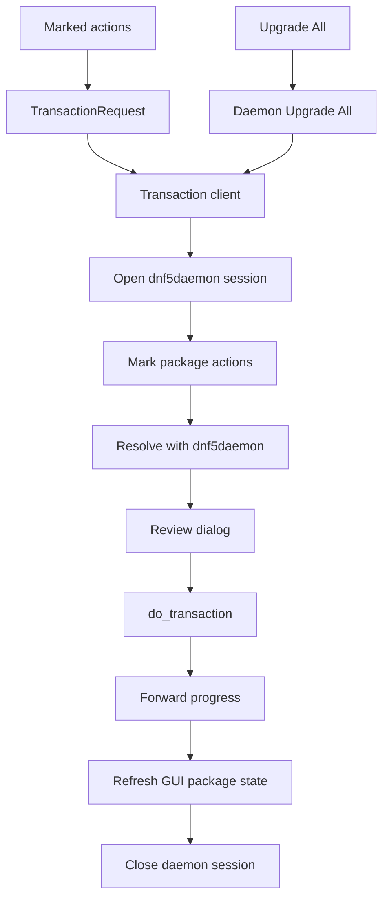

# Transaction flow

This document explains how package preview and apply work.

For source-backed libdnf5, GDBus, and dnf5daemon assumptions, see
[External API assumptions](api-assumptions.md).

## Boundary

The GUI process stays unprivileged.

Package search and details happen in the GUI process through libdnf5. Package
changes go through DNF5 dnf5daemon on the system bus. dnf5daemon owns the
privileged package operation and its Polkit authorization behavior.

Important files:

- [src/ui/transaction/pending_transaction_controller.cpp](../src/ui/transaction/pending_transaction_controller.cpp)
- [src/ui/transaction/pending_transaction_apply.cpp](../src/ui/transaction/pending_transaction_apply.cpp)
- [src/ui/transaction/pending_transaction_request.cpp](../src/ui/transaction/pending_transaction_request.cpp)
- [src/ui/transaction/transaction_dialogs.cpp](../src/ui/transaction/transaction_dialogs.cpp)
- [src/ui/transaction/transaction_progress.cpp](../src/ui/transaction/transaction_progress.cpp)
- [src/transaction_request.hpp](../src/transaction_request.hpp)
- [src/dnf5daemon_client/transaction_service_client.cpp](../src/dnf5daemon_client/transaction_service_client.cpp)
- [src/dnf5daemon_client/transaction_service_client_dbus.cpp](../src/dnf5daemon_client/transaction_service_client_dbus.cpp)
- [src/dnf5daemon_client/transaction_service_client_wait.cpp](../src/dnf5daemon_client/transaction_service_client_wait.cpp)

## Request model

`TransactionRequest` contains the package specs the user explicitly marked in
the GUI:

- upgrade all
- install
- upgrade
- remove
- reinstall

Dependency changes are not stored in the request. dnf5daemon resolves those
changes when the preview is built.

Upgrade-all requests are separate from explicit package action lists. DNF UI
asks dnf5daemon to prepare its native Upgrade All transaction. Selected package
upgrades are sent as explicit upgrade specs.

## GUI flow

When the user clicks Apply:

1. The pending controller validates the pending actions.
2. The controller builds a `TransactionRequest`.
3. The transaction client opens a dnf5daemon session.
4. The client marks install, upgrade, remove, or reinstall specs on that session.
5. The client asks dnf5daemon to resolve the transaction with user interaction enabled.
6. If dnf5daemon requests a repository signing key during resolve, DNF UI asks before showing the summary.
7. The GUI shows the resolved preview.
8. If the user confirms, the client subscribes to daemon progress signals.
9. The client calls `do_transaction` with interactive authorization enabled.
10. dnf5daemon handles privileged apply work and Polkit behavior.
11. The GUI refreshes package state and closes the daemon session.

When the user clicks Upgrade All, the GUI skips the pending action list and asks
the transaction client to prepare a daemon-side Upgrade All session. If the
resolved preview is empty, the session is closed and the GUI reports that all
packages are already up to date.

When the user clicks Mark Listed Upgrades, the GUI marks the upgrade candidates
currently shown in the package table as normal pending upgrade actions. The user
can then remove individual actions before clicking Apply. This path sends
explicit upgrade specs to dnf5daemon instead of using the daemon-side Upgrade
All shortcut.

## dnf5daemon session lifetime

dnf5daemon sessions are tied to the system bus connection that created them.
The client keeps one shared system bus connection so prepared sessions stay
valid between preview and apply.

Each prepared session must be closed when the GUI no longer needs it:

- preview dialog closed without applying
- preview failed
- apply succeeded
- apply failed
- pending transaction replaced by a new request

Session release is done away from the GTK thread so a slow D-Bus reply does not
freeze the window.

## Preview

Preview resolves the current daemon session and converts the daemon reply into
`TransactionPreview`.

The preview dialog does not lock DNF for other tools. If package state changes
before Apply, dnf5daemon may reject the prepared transaction. DNF UI then closes
that session and the user must prepare a new preview.

The preview dialog only shows actions the app understands:

- install
- upgrade
- downgrade
- reinstall
- remove
- replaced

If dnf5daemon resolves successfully with warnings, the preview shows its
human-readable warning text without treating the transaction as failed.

If dnf5daemon returns an unsupported transaction item or action, preview fails
instead of hiding part of the transaction from the user.

After preview, DNF UI rejects transactions that would remove or replace the
running app package or the daemon needed for package changes. Normal upgrades
are allowed.

If Upgrade All resolves to an empty preview, the GUI reports that all packages
are already up to date. If a selected package action resolves to an empty
preview, the GUI reports that no transaction changes were returned.

## Apply

Apply uses the same daemon session that produced the preview.

The `do_transaction` call is allowed to wait without a normal D-Bus timeout
because the user may need time to answer a Polkit prompt. A short D-Bus timeout
can make the GUI report failure while the authorization dialog is still open.

The GUI does not perform authorization itself. dnf5daemon owns that boundary.

dnf5daemon loads the normal DNF configuration and then its own
`/etc/dnf/dnf5daemon-server.conf` file. Package downloads during Apply are done
by dnf5daemon, so they may use the daemon cache instead of the cache used by an
interactive `dnf` command.

## Repository Signing Keys

When dnf5daemon needs a repository signing key during preview or apply, DNF UI
shows the key details and asks the user whether to trust it.

The transaction client still owns the daemon protocol. The UI only answers yes
or no, and the client sends that answer back to the same daemon session.

The same trust dialog is used during preview and apply. During preview it is
shown before the transaction summary can be prepared.

## Progress

The transaction client subscribes to dnf5daemon progress signals and forwards a
small set of useful messages to the existing progress window.

The progress window should help the user understand what phase the transaction
is in without becoming a debug log. Current messages cover:

- package downloads
- mirror failures
- transaction start
- package verification
- transaction preparation
- package processing
- unpack errors

## Local transaction path

DNF UI does not keep a local libdnf transaction apply path.

The GTK process may query package metadata with libdnf5, but transaction preview
and apply go through dnf5daemon. That keeps privileged package changes outside
the GUI process and avoids carrying a second transaction implementation.
