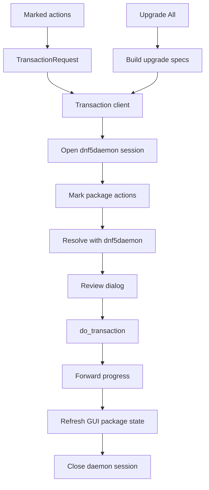

# Transaction flow

This document explains how package preview and apply work.

For source-backed libdnf5, GDBus, and dnf5daemon assumptions, see
[External API assumptions](api-assumptions.md).

## Boundary

The GUI process stays unprivileged.

Package search and details happen in the GUI process through libdnf5. Package
changes go through DNF5 dnf5daemon on the system bus. dnf5daemon owns the
privileged package operation and its Polkit authorization behavior.

Important files:

- [src/ui/pending_transaction_controller.cpp](../src/ui/pending_transaction_controller.cpp)
- [src/ui/pending_transaction_apply.cpp](../src/ui/pending_transaction_apply.cpp)
- [src/ui/pending_transaction_request.cpp](../src/ui/pending_transaction_request.cpp)
- [src/ui/transaction_review_dialog.cpp](../src/ui/transaction_review_dialog.cpp)
- [src/ui/transaction_progress.cpp](../src/ui/transaction_progress.cpp)
- [src/transaction_request.hpp](../src/transaction_request.hpp)
- [src/transaction_service_client.cpp](../src/transaction_service_client.cpp)
- [src/transaction_service_client_dbus.cpp](../src/transaction_service_client_dbus.cpp)
- [src/transaction_service_client_wait.cpp](../src/transaction_service_client_wait.cpp)

## Request model

`TransactionRequest` contains the package specs the user explicitly marked in
the GUI:

- upgrade all
- install
- remove
- reinstall

Dependency changes are not stored in the request. dnf5daemon resolves those
changes when the preview is built.

Upgrade-all requests are separate from explicit package action lists. DNF UI
builds the upgrade candidate list from the local backend, skips packages that
are protected while the app is running, and sends the remaining specs to
dnf5daemon.

## GUI flow

When the user clicks Apply:

1. The pending controller validates the pending actions.
2. The controller builds a `TransactionRequest`.
3. The transaction client opens a dnf5daemon session.
4. The client marks install, remove, or reinstall specs on that session.
5. The client asks dnf5daemon to resolve the transaction.
6. The GUI shows the resolved preview.
7. If the user confirms, the client subscribes to daemon progress signals.
8. The client calls `do_transaction` with interactive authorization enabled.
9. dnf5daemon handles privileged apply work and Polkit behavior.
10. The GUI refreshes package state and closes the daemon session.

When the user clicks Upgrade All, the GUI skips the pending action list and asks
the transaction client to prepare an upgrade session from current upgrade
candidates. If the resolved preview is empty, the session is closed and the GUI
reports that all packages are already up to date.

## dnf5daemon session lifetime

dnf5daemon sessions are tied to the system bus connection that created them.
The client keeps one shared system bus connection so prepared sessions stay
valid between preview and apply.

Each prepared session must be closed when the GUI no longer needs it:

- preview dialog closed without applying
- preview failed
- apply succeeded
- apply failed
- pending transaction replaced by a new request

Session release is done away from the GTK thread so a slow D-Bus reply does not
freeze the window.

## Preview

Preview resolves the current daemon session and converts the daemon reply into
`TransactionPreview`.

The preview dialog does not lock DNF for other tools. If package state changes
before Apply, dnf5daemon may reject the prepared transaction. DNF UI then closes
that session and the user must prepare a new preview.

The preview dialog only shows actions the app understands:

- install
- upgrade
- downgrade
- reinstall
- remove

If dnf5daemon returns an unsupported transaction item or action, preview fails
instead of hiding part of the transaction from the user.

## Apply

Apply uses the same daemon session that produced the preview.

The `do_transaction` call is allowed to wait without a normal D-Bus timeout
because the user may need time to answer a Polkit prompt. A short D-Bus timeout
can make the GUI report failure while the authorization dialog is still open.

The GUI does not perform authorization itself. dnf5daemon owns that boundary.

## Progress

The transaction client subscribes to dnf5daemon progress signals and forwards a
small set of useful messages to the existing progress window.

The progress window should help the user understand what phase the transaction
is in without becoming a debug log. Current messages cover:

- package downloads
- mirror failures
- transaction start
- package verification
- transaction preparation
- package processing
- unpack errors

## Local backend transaction code

Some local backend transaction code still exists:

- [src/dnf_backend/dnf_transaction.cpp](../src/dnf_backend/dnf_transaction.cpp)
- [src/dnf_backend/dnf_transaction_callbacks.cpp](../src/dnf_backend/dnf_transaction_callbacks.cpp)
- [src/dnf_backend/dnf_transaction_format.cpp](../src/dnf_backend/dnf_transaction_format.cpp)

That code is no longer the normal privileged apply path. It remains because some
preview helpers and tests still use shared transaction formatting and preview
types. Keep this area under review so unused apply-only code can be removed when
the dnf5daemon test coverage is complete.
