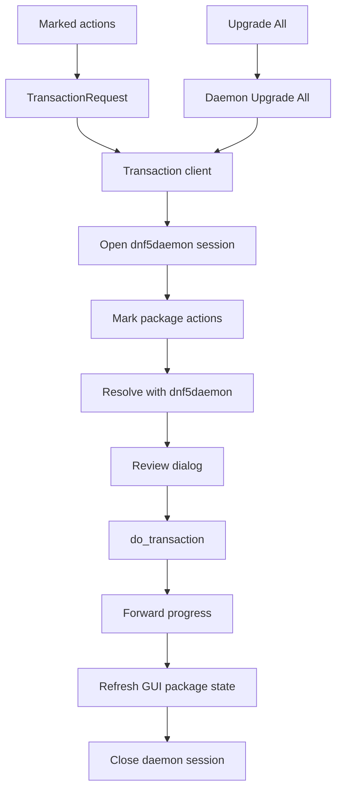

# Transaction flow

This document explains how package preview and apply work.

For source-backed libdnf5, GDBus, and dnf5daemon assumptions, see
[External API assumptions](api-assumptions.md).

## Boundary

The GUI process stays unprivileged.

Package search and details happen in the GUI process through libdnf5. Package
changes go through DNF5 dnf5daemon on the system bus. dnf5daemon owns the
privileged package operation and its Polkit authorization behavior.

Important files:

- [src/ui/transaction/pending_transaction_controller.cpp](../src/ui/transaction/pending_transaction_controller.cpp)
- [src/ui/transaction/pending_transaction_apply.cpp](../src/ui/transaction/pending_transaction_apply.cpp)
- [src/ui/transaction/pending_transaction_request.cpp](../src/ui/transaction/pending_transaction_request.cpp)
- [src/ui/transaction/transaction_dialogs.cpp](../src/ui/transaction/transaction_dialogs.cpp)
- [src/ui/transaction/transaction_progress.cpp](../src/ui/transaction/transaction_progress.cpp)
- [src/transaction/transaction_request.hpp](../src/transaction/transaction_request.hpp)
- [src/transaction/transaction_preview.hpp](../src/transaction/transaction_preview.hpp)
- [src/dnf5daemon_client/transaction_service_client.cpp](../src/dnf5daemon_client/transaction_service_client.cpp)
- [src/dnf5daemon_client/transaction_service_client_dbus.cpp](../src/dnf5daemon_client/transaction_service_client_dbus.cpp)
- [src/dnf5daemon_client/transaction_service_client_wait.cpp](../src/dnf5daemon_client/transaction_service_client_wait.cpp)

## Request model

`TransactionRequest` contains the package specs the user explicitly marked in
the GUI:

- upgrade all
- install
- upgrade
- downgrade
- remove
- reinstall

Dependency changes are not stored in the request. dnf5daemon resolves those
changes when the preview is built.

Upgrade-all requests are separate from explicit package action lists. DNF UI
asks dnf5daemon to prepare its native Upgrade All transaction. Selected package
upgrades are sent as explicit upgrade specs. Selected downgrades are sent as
exact NEVRA specs so the daemon is asked for the version the user selected.

Install, upgrade, and downgrade are install-side actions. Only one install-side
action is kept for one package name and architecture at a time, except for
exact install actions on install-only packages. DNF can install several exact
versions of install-only packages such as kernels side by side. Remove and
reinstall actions are tied to exact installed NEVRAs, so systems with parallel
installed versions can mark those installed versions independently.

## GUI flow

When the user clicks Apply:

1. The pending controller validates the pending actions.
2. The controller builds a `TransactionRequest`.
3. The transaction client opens a dnf5daemon session.
4. The client marks install, upgrade, downgrade, remove, or reinstall specs on that session.
5. The client asks dnf5daemon to resolve the transaction with user interaction enabled.
6. If dnf5daemon requests a repository signing key during resolve, DNF UI asks before showing the summary.
7. The GUI shows the resolved preview.
8. If the user confirms, the client subscribes to daemon progress signals.
9. The client calls `do_transaction` with interactive authorization enabled.
10. dnf5daemon handles privileged apply work and Polkit behavior.
11. The GUI refreshes package state and closes the daemon session.

Pending actions are cleared after a successful apply. If apply fails after the
daemon reports that RPM work started, pending actions are also cleared because
the old request no longer describes what still needs to be done. Failures before
RPM work starts keep pending actions so the user can retry.

When the user clicks Upgrade All, the GUI skips the pending action list and asks
the transaction client to prepare a daemon-side Upgrade All session. If the
resolved preview is empty, the session is closed and the GUI reports that all
packages are already up to date.

When the user clicks Mark Listed Upgrades, the GUI marks the upgrade candidates
currently shown in the package table as normal pending upgrade actions. The user
can then remove individual actions before clicking Apply. This path sends
explicit upgrade specs to dnf5daemon instead of using the daemon-side Upgrade
All shortcut. Downgradeable rows and intermediate newer rows are not included
by Mark Listed Upgrades.

```mermaid
flowchart TD
    Marked[Marked actions] --> Request[TransactionRequest]
    UpgradeAll[Upgrade All] --> DaemonUpgradeAll[Daemon Upgrade All]
    Request --> Client[Transaction client]
    DaemonUpgradeAll --> Client
    Client --> Open[Open dnf5daemon session]
    Open --> Mark[Mark package actions]
    Mark --> Resolve[Resolve with dnf5daemon]
    Resolve --> Dialog[Review dialog]
    Dialog --> Apply[do_transaction]
    Apply --> Progress[Forward progress]
    Progress --> Refresh[Refresh GUI package state]
    Refresh --> Close[Close daemon session]
```

## dnf5daemon session lifetime

dnf5daemon sessions are tied to the system bus connection that created them.
The client keeps one shared system bus connection so prepared sessions stay
valid between preview and apply.

Each prepared session must be closed when the GUI no longer needs it:

- preview dialog closed without applying
- preview failed
- apply succeeded
- apply failed
- pending transaction replaced by a new request

Session release is done away from the GTK thread so a slow D-Bus reply does not
freeze the window.

## Preview

Preview resolves the current daemon session and converts the daemon reply into
`TransactionPreview`.
Each preview package carries the label shown in the summary dialog together
with the package name and architecture used by safety checks.

The preview dialog does not lock DNF for other tools. If package state changes
before Apply, dnf5daemon may reject the prepared transaction. DNF UI then closes
that session and the user must prepare a new preview.

The preview dialog only shows actions the app understands:

- install
- upgrade
- downgrade
- reinstall
- remove
- replaced

If dnf5daemon resolves successfully with warnings, the preview shows its
human-readable warning text without treating the transaction as failed.

If dnf5daemon returns an unsupported transaction item or action, preview fails
instead of hiding part of the transaction from the user.

After preview, DNF UI rejects transactions that would downgrade, reinstall,
remove, or replace the running app package. A normal upgrade may list the old
package as replaced, so replacement is checked against the complete preview
before it is treated as unsafe. DNF UI also rejects transactions that would
remove dnf5daemon-server or replace it without a same-name successor in the
preview. Changes that keep the daemon package installed are allowed, but must
use offline preparation as described below.

The preview is still authoritative. A pending downgrade records an exact NEVRA
chosen from the table, but the user must still review the resolved daemon
transaction before apply.

If Upgrade All resolves to an empty preview, the GUI reports that all packages
are already up to date. If a selected package action resolves to an empty
preview, the GUI reports that no transaction changes were returned.

## Apply

Apply uses the same daemon session that produced the preview.

The `do_transaction` call is allowed to wait without a normal D-Bus timeout
because the user may need time to answer a Polkit prompt. A short D-Bus timeout
can make the GUI report failure while the authorization dialog is still open.

The GUI does not perform authorization itself. dnf5daemon owns that boundary.

dnf5daemon loads the normal DNF configuration and then its own
`/etc/dnf/dnf5daemon-server.conf` file. Package downloads during Apply are done
by dnf5daemon, so they may use the daemon cache instead of the cache used by an
interactive `dnf` command.

## Updating the package service

A resolved transaction that installs, upgrades, downgrades, reinstalls, or replaces
`dnf5daemon-server` is prepared for the next reboot. This includes daemon changes
pulled in as dependencies. Other transactions still apply immediately.

The daemon package's RPM scriptlet can request a service restart while that same
service is executing the transaction. Losing the D-Bus connection is not the only
problem: systemd can terminate an RPM scriptlet in the daemon's control group.
Reconnecting or seeing the new package versions afterward does not prove that
all transaction scripts completed.

DNF UI uses DNF's existing offline implementation:

1. The summary shows every resolved change, explains the reboot requirement, and
   labels its approval button **Prepare for Reboot**.
2. The client records the required apply mode with the prepared daemon session.
   Apply must use that same session and mode; there is no live fallback.
3. `Goal.do_transaction` receives `offline=true` and `interactive=true`. The
   daemon downloads and tests the complete transaction and schedules it for the
   next boot. The app does not restart the computer.
4. The client checks `Offline.get_status` before reporting readiness. A successful
   preparation is displayed as **Ready for Reboot**, not as an installation.
   Marked actions are cleared, while installed package state remains unchanged.
5. At the next boot, DNF's offline service executes the stored transaction through
   the DNF command-line process, separately from the package daemon. A restart of
   the daemon therefore cannot kill the process applying these updates.

**Package > Updates Prepared for Reboot** reads the daemon's current status even
when the app has been restarted. It distinguishes ready, incomplete, unscheduled,
and absent transaction data. **Discard Prepared Changes** asks the daemon to
cancel and clean its stored transaction and downloaded packages through Polkit.
Discarding does not undo installed package changes. Completed or interrupted RPM
work can be reviewed in **Transaction History**.

Before preview and again before apply, the client checks for stored offline data
and systemd's update boot triggers. Further transactions are rejected until those
updates have been applied or explicitly discarded, so a normal Apply does not
silently invalidate an earlier prepared transaction. Browsing remains available.
Updates scheduled by other tools must be managed with those tools.

Preparation errors preserve the marked actions and point to the prepared-update
view. A lost reply can leave stored data behind, so the app never retries the same
submitted session or falls back to live execution. A fresh preview is required.

The DNF API does not provide an atomic reservation covering another package
manager and this app's status check. It remains possible for an external tool to
change package or offline state concurrently. The daemon owns RPM locking and
offline transaction validity; this UI does not add service overrides, manipulate
system files, or implement a second privileged backend.

## Repository Signing Keys

When dnf5daemon needs a repository signing key during preview or apply, DNF UI
shows the key details and asks the user whether to trust it.

The transaction client still owns the daemon protocol. The UI only answers yes
or no, and the client sends that answer back to the same daemon session.

The same trust dialog is used during preview and apply. During preview it is
shown before the transaction summary can be prepared.

If the preview or apply task is cancelled while the trust dialog is waiting, DNF
UI treats the key as rejected and wakes the worker. The app must never import a
repository signing key after the user cancels the task.

## Progress

The transaction client subscribes to dnf5daemon progress signals and forwards a
small set of useful messages to the existing progress window.

The progress window should help the user understand what phase the transaction
is in without becoming a debug log. Current messages cover:

- package downloads
- mirror failures
- transaction start
- package verification
- transaction preparation
- package processing
- unpack errors

## Local transaction path

DNF UI does not keep a local libdnf transaction apply path.

The GTK process may query package metadata with libdnf5, but transaction preview
and apply go through dnf5daemon. That keeps privileged package changes outside
the GUI process and avoids carrying a second transaction implementation.
